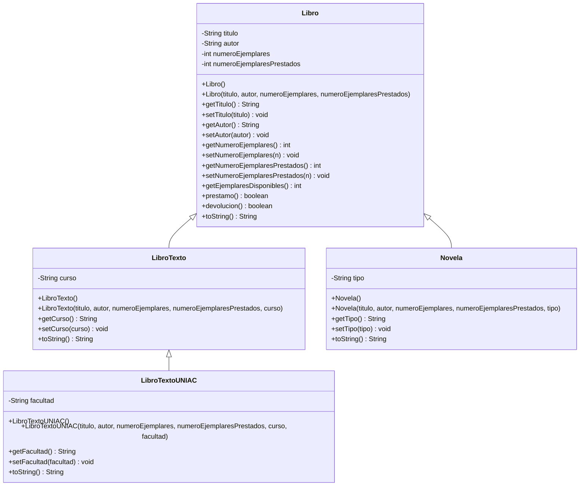

# Parcial I - Programación II - G411
## Sistema de gestión de biblioteca (POO: Abstracción, Encapsulamiento y Herencia)

Proyecto Maven muy simple, sin librerías externas (solo lo básico del JDK: `Scanner` para leer datos por consola).

---

## 1. Estructura del proyecto

```
biblioteca-parcial/
├── pom.xml
├── .gitignore
├── README.md
└── src/main/java/com/biblioteca/
    ├── Libro.java
    ├── LibroTexto.java
    ├── LibroTextoUNIAC.java
    ├── Novela.java
    └── Main.java
```

---

## 2. Diagrama UML de clases 




---